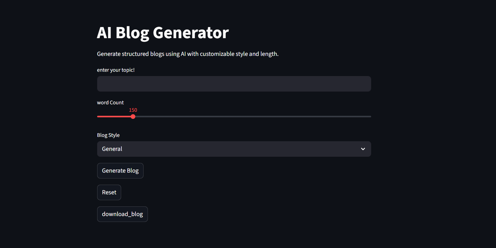
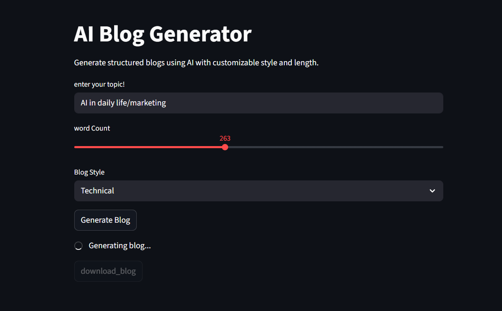
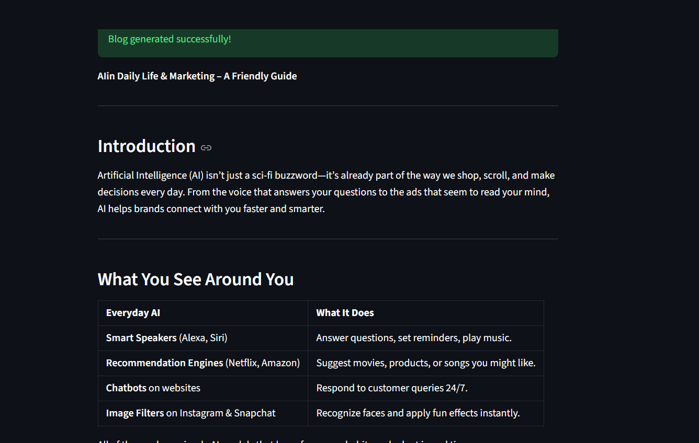

## AI Blog Generator

An AI-powered blog generation app built using LLM APIs and Streamlit.  
Users can enter a topic and generate a structured blog with introduction, body, and conclusion.

##  Features
- Generate blogs from any topic
- Multiple blog styles (Technical, General, Creative)
- Minimum word control
- Clean UI using Streamlit
- Download generated blog
- Loading spinner for better UX
- Session state management

## 🛠 Tech Stack
- Python
- Streamlit
- OpenAI SDK (via OpenRouter)
- Prompt Engineering

## Requirement.text
streamlit
openai

##  ScreenShort
  

  

  
  

##  Setup

1. Clone the repo:https://github.com/sonukumar5043/AI-Blog-Generator

## How it works
- Uses system + user prompt structure
- Sends request to LLM viva api_key
- Generates structured blog output
- Displays and allows download

##  Future Improvements
- Add SEO optimization
- Multi-language support
- PDF export
- Chat history memory

##  Author
Sonu Kumar